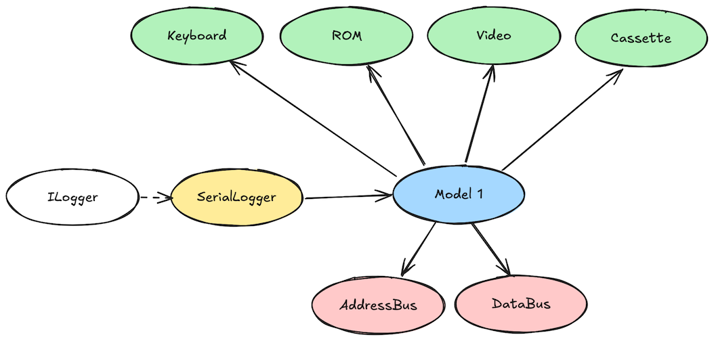
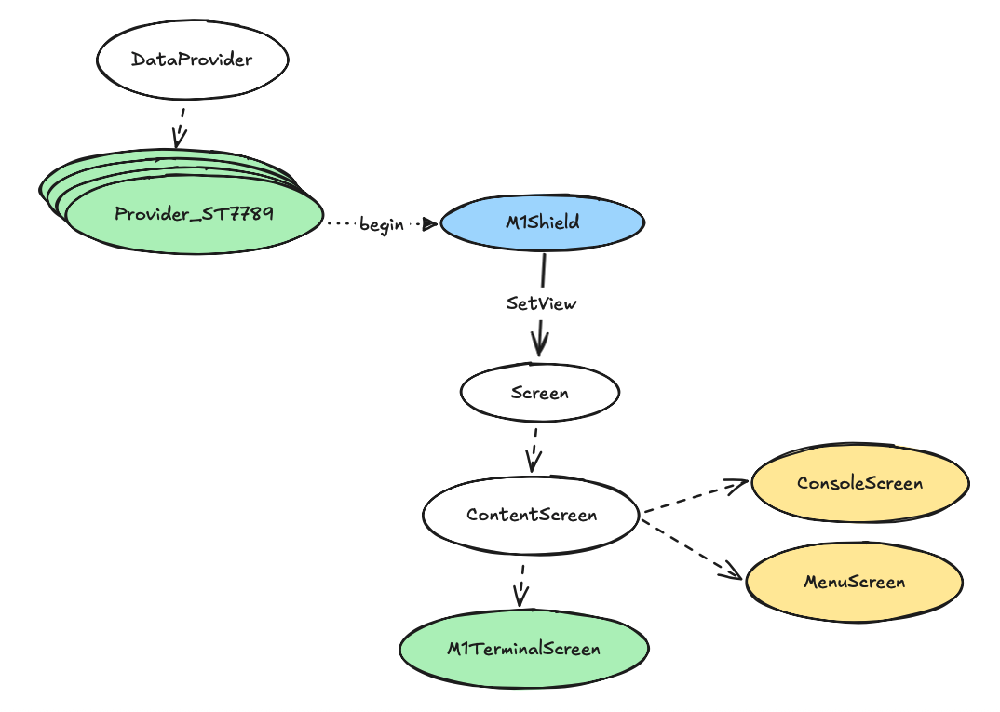

# TRS-80 Model I Arduino Library

This library allows an Arduino to control the TRS-80 Model I mainboard through its edge connector.

## Model 1 Classes

- [**Model1**](Model1.md) — Main interface to control bus signals, memory, and interrupts.
- [**Cassette**](Cassette.md) — Cassette output and video mode control.
- [**Keyboard**](Keyboard.md) — Reading the keyboard matrix.
- [**Video**](Video.md) — Video memory management and text display.
- [**ROM**](ROM.md) — ROM reading, checksumming, and identification.

## Hardware Connection

- [**Pin Mapping**](PinMapping.md) — Complete pin mapping between TRS-80 edge connector and Arduino Mega 2560 for direct wiring connections.
- [**TEST Signal Modification**](TESTMod.md) — Critical hardware fix for TRS-80 Model I bus request design flaw to prevent memory corruption and crashes.

## Logging Classes

- [**ILogger**](ILogger.md) — Logging interface.
- [**SerialLogger**](SerialLogger.md) — Logging implementation to Serial output.
- [**CompositeLogger**](CompositeLogger.md) — Multi-destination logger that forwards events to multiple registered loggers.

## Shield Access

- [**M1Shield**](M1Shield.md) — Hardware abstraction layer for display, input, LED control, and screen management.
- [**DisplayProvider**](DisplayProvider.md) — Flexible display support system with optimized providers for different controller types (ST7789, ST7735, ILI9341, ST7796, HX8357, ILI9325).

## Screen Management

- [**Screen**](Screen.md) — Abstract base class for all user interface screens with lifecycle and input handling.
- [**ContentScreen**](ContentScreen.md) — Structured layout template with header, content, footer, and progress regions.
- [**ConsoleScreen**](ConsoleScreen.md) — Terminal-like scrollable text output with auto-clear behavior for debugging and logging interfaces.
- [**LoggerScreen**](LoggerScreen.md) — Visual logging destination compatible with ILogger interface with color-coded output and timestamps.
- [**MenuScreen**](MenuScreen.md) — Paginated menu framework with automatic navigation and selection handling.
- [**M1TerminalScreen**](M1TerminalScreen.md) — TRS-80 Model I terminal emulation with 64×16 character grid and Model1 integration.
