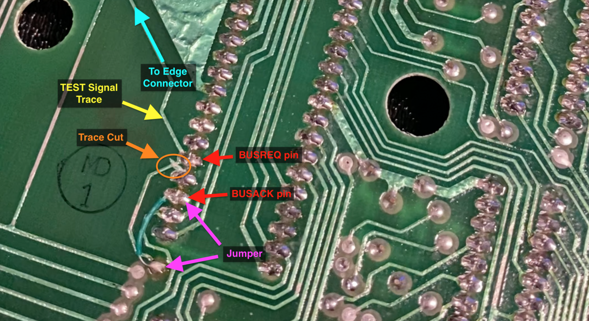

# TRS-80 Model I Bus Request Design Flaw (and Hardware Fix)

**Note:** This modification is only necessary if preserving the system state before and after returning control to the Model I is important for your use case.

## Table of Contents

- [Background](#background)
- [Root Cause](#root-cause)
- [Observed Behavior](#observed-behavior)
- [Hardware Fix](#hardware-fix)
  - [Result](#result)
- [Legacy Use Case: Screen Printers](#legacy-use-case-screen-printers)

## Background

The TRS-80 Model I (all revisions, including the G revision and later TEC/Japanese versions) contains a **hardware design flaw** related to the `TEST` signal and how it interacts with the CPU's bus control lines. This flaw can intermittently **corrupt memory or crash the CPU** when external devices attempt to take over the bus.

## Root Cause

When the `TEST` signal is asserted:

- It directly triggers the **BUS REQUEST (BUSREQ)** line on the Z80 CPU.
- This tells the CPU to relinquish control of its data, address, and control buses.
- However, the **BUS ACKNOWLEDGE (BUSACK)** line-which signals that the CPU has _finished_ its current instruction and is ready-is **ignored**.

As a result, the system **immediately disconnects buffers** and reconfigures `DBIN`/`DBOUT`, possibly _mid-instruction_. This can corrupt data transfers or cause crashes if the CPU is in the middle of a read/write operation.

## Observed Behavior

- In \~70-80% of cases, triggering the test signal works without issue.
- In the remaining cases-especially if a bus access is active-the system can crash or reset.
- This behavior is intermittent and unpredictable.

## Hardware Fix

To correct this issue:

1. **Disconnect the TEST signal from directly gating the bus buffers and DBIN/DBOUT logic.**
2. **Rewire the gating control to use the BUSACK signal instead.**

   - This ensures that the CPU has fully released the bus before peripherals take over.

In hardware, following steps need to be followed:

1. Cut the TEST trace (orange): Locate the trace carrying the TEST signal (blue) to the CPU's BUSREQ pin (red). Make a precise cut after it reaches the CPU but before it continues on to other circuitry (orange). Use a continuity tester to verify the CPU still receives TEST (blue), but the downstream buffers are now disconnected (at via - purple).
2. Add a jumper wire (purple): Solder a jumper from the BUSACK pin (red) of the CPU to the via or trace formerly driven by TEST (now disconnected - purple). This ensures the gating logic is only activated after the CPU has fully relinquished control of the bus.

### Result

- Prevents mid-instruction bus contention.
- Eliminates data corruption or crashes during TEST signal use.

## Legacy Use Case: Screen Printers

- Devices like early TRS-80-compatible **screen printers** used the `TEST` signal to dump video RAM to paper.
- Under the original flawed design, this occasionally would cause instability.
